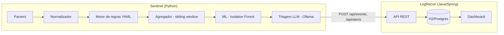

# Mini-SIEM: Sentinel + LogRecon

Este projeto é dividido em dois sistemas separados que se comunicam via API REST:

- **Sentinel** (Python) — o cérebro: lê logs brutos, entende o que está acontecendo e decide o que é um alerta.
- **LogRecon** (Java + Spring Boot) — o corpo: recebe o que o Sentinel decidiu, guarda em banco, expõe API e mostra num dashboard.

Nenhum dos dois duplica o trabalho do outro. O Sentinel nunca persiste nada de forma definitiva nem serve API pra terceiros; o LogRecon nunca faz parsing de log nem decide sozinho o que é um alerta.

---

## Sumário

- [O que o Sentinel faz](https://claude.ai/chat/79ded7d2-091f-427a-aa2b-ccb989876e30#o-que-o-sentinel-faz)
- [Progresso do Sentinel](https://claude.ai/chat/79ded7d2-091f-427a-aa2b-ccb989876e30#progresso-do-sentinel)
- [Para que serve o LogRecon](https://claude.ai/chat/79ded7d2-091f-427a-aa2b-ccb989876e30#para-que-serve-o-logrecon)
- [Progresso do LogRecon](https://claude.ai/chat/79ded7d2-091f-427a-aa2b-ccb989876e30#progresso-do-logrecon)
- [Como os dois se conectam](https://claude.ai/chat/79ded7d2-091f-427a-aa2b-ccb989876e30#como-os-dois-se-conectam)

---

## O que o Sentinel faz

O Sentinel é quem lê o log bruto (por enquanto, `auth.log` de SSH) e decide, com base em regras e depois em modelos, se aquilo é normal ou se é um alerta de segurança:

1. **Parser** — lê a linha crua do log e extrai os campos (usuário, IP, tipo de evento, timestamp).
2. **Normalizador** — transforma isso num formato padronizado e tipado, independente da fonte original.
3. **Motor de regras** — compara o evento normalizado contra regras YAML mapeadas pra táticas do MITRE ATT&CK (ex: "5 logins falhos do mesmo IP em 2 minutos" → Credential Access).
4. **Agregador** — junta eventos relacionados numa janela de tempo (sliding window), pra regras que dependem de repetição, não de um evento isolado.
5. **Camada de ML** (Isolation Forest) — detecta anomalias que as regras fixas não cobrem.
6. **Triagem por LLM** (Ollama local, por privacidade) — dá uma segunda opinião mais "humana" sobre o que os passos anteriores sinalizaram, antes de virar alerta de verdade.
7. Ao final, o que sobrevive esse pipeline inteiro é enviado pro LogRecon via API REST.

## Progresso do Sentinel

- [x] **Fase 1 — Parsers de log** (`auth_parser.py`, classe `BaseParser` abstrata, padrões YAML)
- [x] **Fase 2 — Normalizador** (`normalizer.py`, dataclass `Event` tipado, `EventType` Enum, validação via `EXPECTED_FIELDS`)
- [x] **Fase 3 — Motor de detecção baseado em regras** (`RuleLoader`, `EngineRule`, 16 regras YAML validadas em 4 categorias MITRE ATT&CK)
- [ ] **Fase 4 — Agregador (sliding window)** — `LoginFailureAggregator` funcionando; integração via `EventProcessor` orquestrando `EngineRule` + agregador em andamento
- [ ] **Fase 5 — Camada de ML (Isolation Forest)** — intencionalmente pausada até o motor de regras/agregador estabilizar
- [ ] **Fase 6 — Triagem por LLM (Ollama local)**
- [ ] **Fase 7 — Mapeamento/enriquecimento MITRE ATT&CK** (catálogo completo, não só o que já está embutido nas regras)
- [ ] **Fase 8 — Gerenciador de alertas/relatórios + integração com a API do LogRecon** (enviar eventos/alertas via `POST /api/events` e `POST /api/alerts`)

---

## Para que serve o LogRecon

O LogRecon **não decide o que é um alerta** — essa responsabilidade é só do Sentinel. O papel dele é:

- Expor uma **API REST** que recebe eventos e alertas já processados.
- **Persistir** tudo de forma estruturada (fontes, eventos, regras, alertas, táticas MITRE).
- Servir um **dashboard** web pra visualizar o que está acontecendo, sem precisar mexer em banco ou script Python.

## Progresso do LogRecon

- [x] **Etapa 0 — Escopo e decisões**: log único pra começar (SSH `auth.log`), banco H2 em memória
- [x] **Etapa 1 — Setup do projeto Spring Boot**
- [x] **Etapa 2 — Modelagem das entidades JPA**, com teste próprio pra cada uma:
    - [x] `LogSource`
    - [x] `LogEvent`
    - [x] `MitreTactic`
    - [x] `DetectionRule`
    - [x] `Alert`
    - [x] `AlertEvent` (associativa N:N entre `Alert` e `LogEvent`)
- [x] **Etapa 3 — API REST de ingestão**
    - [x] `POST /api/sources` — cadastra `LogSource` (testado via curl)
    - [x] `POST /api/events` — recebe `LogEvent` já processado, resolve a fonte pelo nome (testado via curl)
    - [ ] Endpoints de consulta (`GET /api/events`, filtros por severidade/data)
- [ ] **Etapa 4 — API REST de alertas**
    - [ ] `POST /api/alerts` — recebe alerta já classificado pelo Sentinel (cria `DetectionRule`/reusa existente + vincula `LogEvent`s via `AlertEvent`)
    - [ ] `GET /api/alerts` — lista/filtra alertas, com paginação
- [ ] **Etapa 5 — Autenticação service-to-service** (API key simples entre Sentinel e LogRecon)
- [ ] **Etapa 6 — Dashboard** (HTML/CSS/JS puro consumindo a API: tabela de eventos recentes, contador por severidade, gráfico de eventos por hora)
- [ ] **Etapa 7 — Polimento pro GitHub** (README próprio do repositório, prints do dashboard, log de exemplo incluso)

---

## Como os dois se conectam

Fluxo de dados, na ordem em que acontece:

1. O Sentinel processa um log e termina de decidir a severidade/classificação de um evento.
2. Ele faz `POST /api/events` no LogRecon, informando `sourceName` (a fonte precisa já existir — cadastrada previamente via `POST /api/sources`).
3. Se o pipeline de regras/ML/LLM do Sentinel concluir que aquilo é um alerta, ele faz `POST /api/alerts`, referenciando a regra que disparou e os eventos envolvidos.
4. O LogRecon persiste tudo e serve tanto a consulta via API (`GET`) quanto a visualização no dashboard.

Autenticação entre os dois serviços (Etapa 5 do LogRecon) ainda não está implementada — por enquanto a comunicação é sem autenticação, só em ambiente local de desenvolvimento.

---
